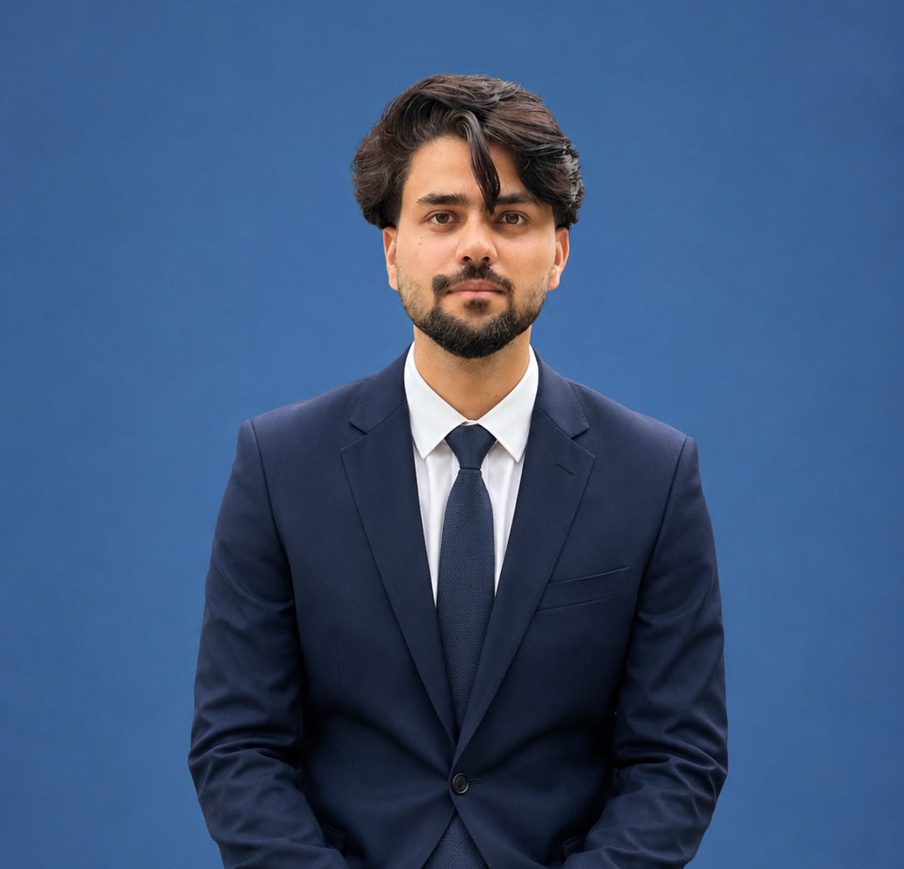
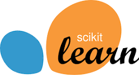
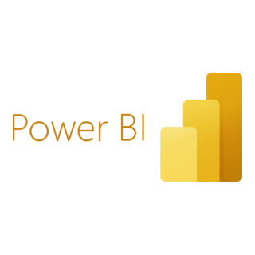
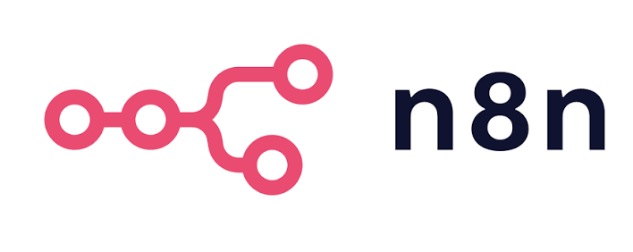
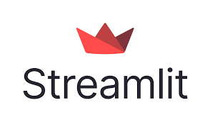
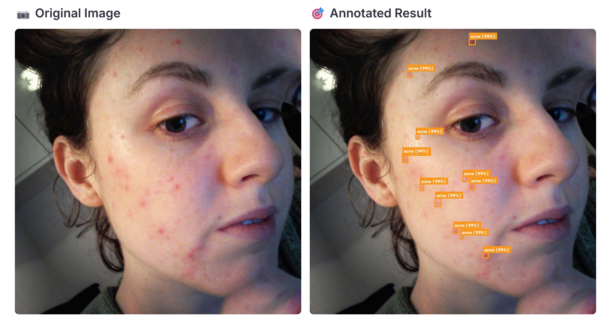
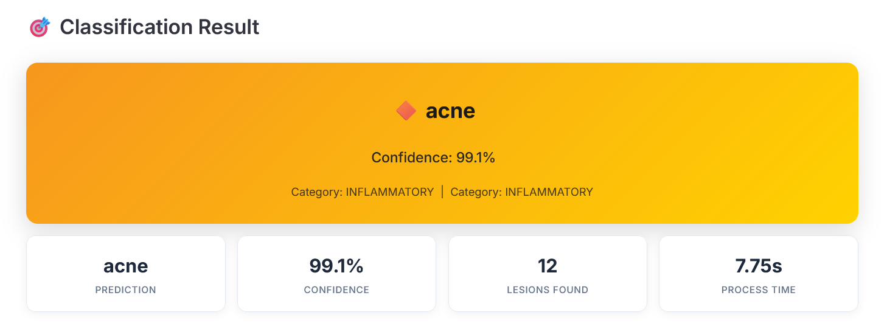
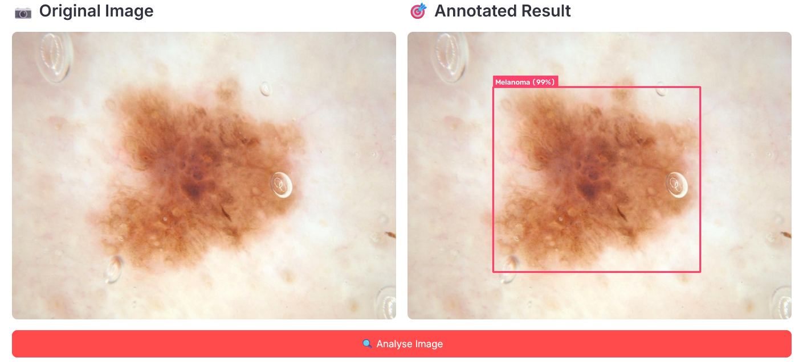
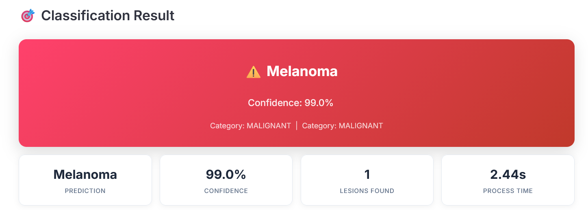

<div align="center">


<br/>

[](#)
[](#)
[](#)

<br/>

[](https://www.linkedin.com/in/anees-a-381224397)
[](mailto:aneesabbasitg@gmail.com)
[](https://github.com/Aneesabbasi19)

<br/>


</div>

<br/>

---

## 🧠 About Me



```yaml
name: "Anees Abbasi"
role: "AI / Machine Learning Engineer"
focus: ["Computer Vision", "NLP", "Deep Learning", "AI Automation"]
mission: "Building AI that creates real-world impact — especially in healthcare and underserved communities"
current_status: "Recent BS AI Graduate | Ex-AI Engineer Intern @ National Centre of Physics"
signature_project: "Dual-Model Ensemble Skin Disease Detection — 91.42% Accuracy across 8 conditions"
```

I'm an AI Engineering graduate from **Pak-Austria Fachhochschule (PAF-IAST)** with hands-on, production-oriented experience across **machine learning, deep learning, computer vision, and NLP**. Over 800+ hours of internship experience, including an ML/DL research role at the **National Centre of Physics (NCP), Islamabad**, sharpened my ability to take models from research to deployment.

My flagship work is a **Dual-Model Ensemble** (ConvNeXtV2-Base + EfficientNetV2-M) fused with **YOLOv8m** for real-time lesion detection — achieving **91.42% accuracy** across 8 clinical skin disease categories, deployed through a Streamlit interface. I approach engineering with a **product mindset**: not just "does the model work," but "does the system solve a real problem end-to-end."

Ranked **8th Nationally (94/100, 100th percentile)** among 33,000+ students in the HEC/PSEB **NSCT 2026**, and continuously expanding into **automation (n8n)**, **BI tooling (Power BI / Power Query)**, and **full-stack delivery** to ship AI products, not just notebooks.

**🎯 Open To:** AI/ML Engineering roles · Computer Vision & NLP roles · Data/Automation Engineering · Research collaborations · Postgraduate research opportunities

---

## 🛠️ Tech Stack

<div align="center">

**Languages**


**AI / ML & Data Frameworks**





**Backend & Databases**


**Tooling, BI & Automation**






</div>

---

## 🧬 AI / ML Expertise

<div align="center">

| Domain | Proficiency | Details |
|---|:---:|---|
| **Computer Vision** | ⭐⭐⭐⭐⭐ | Dual-Model Ensembles, YOLOv8 lesion detection, CVAT annotation, OpenCV pipelines |
| **Deep Learning** | ⭐⭐⭐⭐⭐ | ConvNeXtV2, EfficientNetV2, Focal Loss, SWA, EMA, model optimization |
| **NLP** | ⭐⭐⭐⭐ | HuggingFace Transformers, BERT, TF-IDF, chatbot pipelines, sentiment analysis |
| **Speech & Audio AI** | ⭐⭐⭐⭐ | Whisper-based speech-to-text pipelines |
| **AI Automation** | ⭐⭐⭐⭐ | n8n no-code agent building, Dockerized deployment, workflow orchestration |
| **Data & BI** | ⭐⭐⭐⭐ | Power BI, Power Query ETL, data cleaning, Excel automation with AI-assisted scripting |
| **MLOps / Deployment** | ⭐⭐⭐⭐ | Streamlit deployment, model evaluation & validation pipelines |

</div>

---

## 🚀 Featured Project

<div align="center">

### 🩺 Dual-Model Ensemble Skin Disease Detection System
**PAF-IAST × National Centre of Physics (NCP), Islamabad — Final Year Project**

[](https://github.com/Aneesabbasi19/SkinDiseaseDetection-Classification)

</div>

A clinical-grade computer vision system combining two independent classification backbones with a real-time detection model to identify **8 skin conditions** — including Melanoma, Acne, Psoriasis, and Benign Keratosis.

| Attribute | Detail |
|---|---|
| **Stack** | PyTorch, ConvNeXtV2-Base, EfficientNetV2-M, YOLOv8m, Streamlit |
| **Dataset** | HAM10000 / ISIC dermatology datasets |
| **Performance** | 91.42% Top-1 Accuracy · 91.18% Precision · 91.71% Recall · 91.18% F1-score |
| **Impact** | Assistive clinical screening tool for underserved healthcare access |

Built as an ensemble to reduce single-model bias, this system fuses classification confidence from two CNN backbones with YOLOv8m bounding-box lesion localization, then applies Focal Loss (γ=2.5), Stochastic Weight Averaging, and Exponential Moving Average to stabilize convergence and generalization.

<div align="center">
<br/>

**Live Demo — Multi-lesion Acne Detection**




<br/><br/>

**Live Demo — Melanoma Detection**




</div>

> More projects (NLP dermatology chatbot, driver drowsiness detection, n8n automation agents) — repositories coming soon.

---

## 💼 Experience

### Artificial Intelligence Engineer — National Centre of Physics (NCP)
**Islamabad, Pakistan | 06/2025 – 06/2026**

Conducted applied ML/DL research on automated skin disease detection in collaboration with NCP researchers, translating academic research into a deployable clinical-support system.

- Built and optimized a Dual-Model Ensemble (ConvNeXtV2-Base + EfficientNetV2-M) achieving 93% classification accuracy across 8 skin disease categories
- Integrated YOLOv8m for real-time lesion detection and localization
- Owned dataset curation, model training, evaluation, and result validation end-to-end

`Deep Learning` `Computer Vision` `PyTorch` `Model Evaluation` `Research`

<br/>

### Python Developer — ProSensia SMC Pvt Ltd
**Haripur, Pakistan | 07/2024 – 08/2024**

Delivered internal workflow automation tooling in a fast-paced agile development environment.

- Developed Python scripts to automate internal workflows and improve process efficiency
- Collaborated with team members on weekly development goals using agile practices

`Python` `Automation` `Agile` `Scripting`

<br/>

### Digital Marketing Intern — National Incubation Center (GreenV / NICS / PITB)
**Rawalpindi, Pakistan | 07/2023 – 09/2023**

Supported digital growth strategy for an early-stage incubation environment.

- Executed digital marketing strategies including content creation and social media management
- Drove audience engagement initiatives across platforms
- Assisted in marketing research and performance analytics

`Digital Marketing` `Content Strategy` `Analytics` `Social Media`

---

## 🏆 Achievements

<div align="center">

| Recognition | Details |
|---|---|
| 🥈 **Rank 8 Nationally** | NSCT 2026 — 94/100, 100th Percentile, among 33,000+ students across 188 universities |
| 🎓 **Published-Quality FYP** | 91.42% ensemble accuracy across 8 clinical skin disease categories |
| 🧪 **Research Collaboration** | AI Engineering role at National Centre of Physics (NCP), Islamabad |
| 📊 **Multi-domain Certification Portfolio** | BI, Automation, NLP, Computer Vision & Annotation |

</div>

---

## 📜 Certifications

<div align="center">

**Simplilearn**

[](assets/certificates/power-bi-beginners.pdf)
[](assets/certificates/power-query-excel.pdf)
[](assets/certificates/excel-automation-chatgpt.pdf)
[](assets/certificates/huggingface-projects.pdf)
[](assets/certificates/n8n-course.pdf)

**Coursera**

[-4C1D95?style=for-the-badge&logo=microsoft&logoColor=white)](https://coursera.org/verify/F5Q29993DZ0U)
[](https://coursera.org/verify/ZWAZME74XC9P)

**HEC / PSEB / P@SHA**

[](assets/certificates/nsct-result.pdf)

</div>

---

## 📊 GitHub Analytics

<div align="center">


<br/>


</div>

---

## 🏅 GitHub Trophies

<div align="center">


</div>

---

## 📈 Contribution Activity

<div align="center">


</div>

---

## 🐍 Contribution Snake

<div align="center">


</div>

---

## 🎯 Current Focus

```yaml
Learning:
  - Advanced LangChain / LangGraph for agentic AI systems
  - Cloud deployment (Azure) for ML pipelines
  - Advanced SQL for data engineering workflows

Building:
  - AI automation agents with n8n
  - Computer vision tools for healthcare accessibility
  - Personal AI-powered product prototypes

Exploring:
  - Postgraduate research opportunities in AI/ML
  - MLOps and production-grade model deployment
  - Open-source contributions in CV & NLP

Open To:
  - AI / ML Engineering roles
  - Computer Vision & NLP roles
  - Data & Automation Engineering roles
  - Research collaborations
```

---

## 📬 Connect With Me

<div align="center">

[](mailto:aneesabbasitg@gmail.com)
[](https://www.linkedin.com/in/anees-a-381224397)
[](https://github.com/Aneesabbasi19)

</div>

---

<div align="center">

*"Building AI that doesn't just perform in benchmarks — but creates real-world impact where it's needed most."*


</div>
